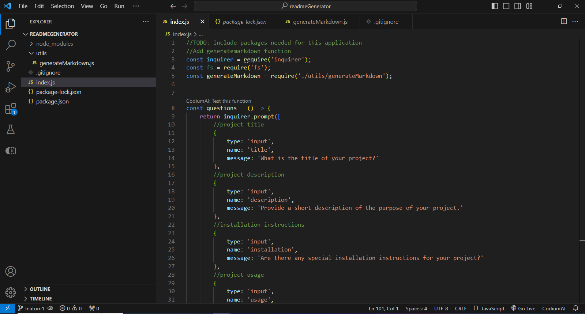
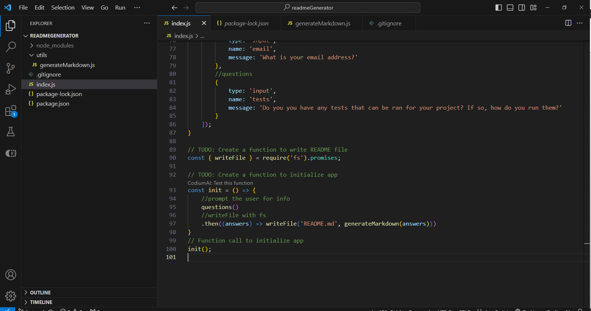
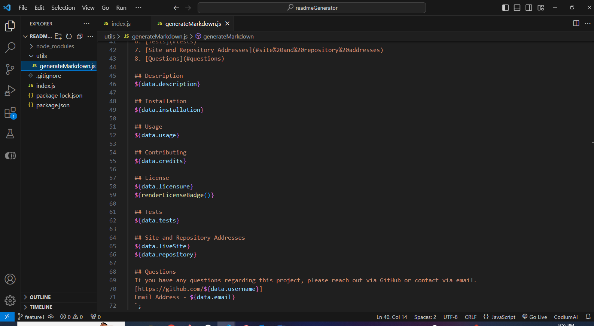
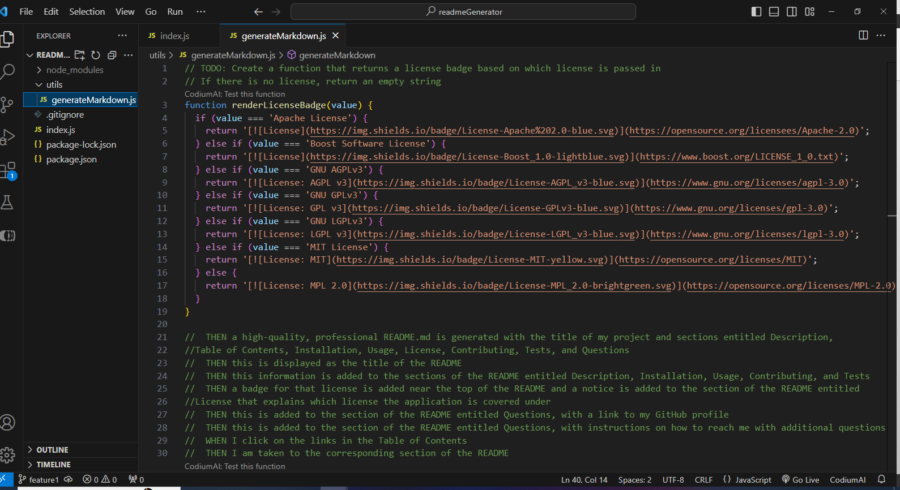
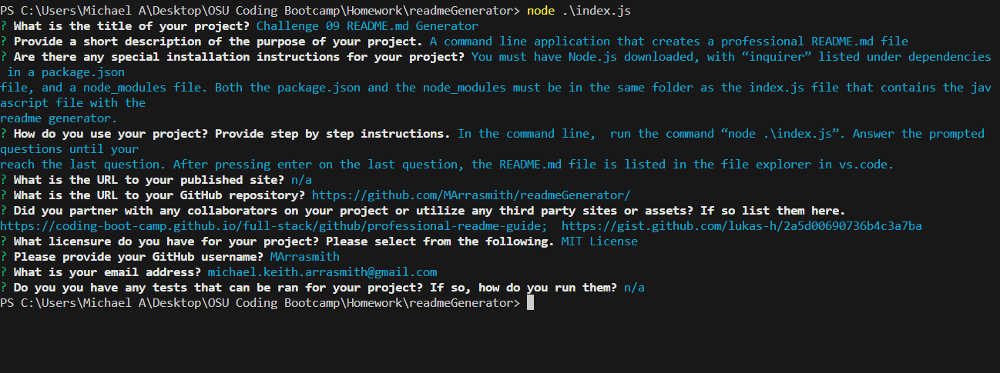

  # Challenge 09 README.md Generator

  ## Table of Contents
  1. [Description](#description)
  2. [Installation](#installation)
  3. [Usage](#usage)
  4. [Contributing](#contributing)
  5. [License](#license)
  6. [Tests](#tests)
  7. [Site and Repository Addresses](#site%20and%20repository%20addresses)
  8. [Questions](#questions)

  ## Description
  A command line application that creates a professional README.md file

  ## Installation
  You must have Node.js downloaded, with “inquirer” listed under dependencies in a package.json file, and a node_modules file. Both the package.json and the node_modules must be in the same folder as the index.js file that contains the javascript file with the readme generator.

  ## Usage
  In the command line,  run the command “node .\index.js”. Answer the prompted questions until your reach the last question. After pressing enter on the last question, the README.md file is listed in the file explorer in vs.code. 

  ## Contributing
  https://coding-boot-camp.github.io/full-stack/github/professional-readme-guide;
  https://gist.github.com/lukas-h/2a5d00690736b4c3a7ba

  ## License
  MIT License
  

  ## Site and Repository Addresses
  https://github.com/MArrasmith/readmeGenerator/

  ## Questions
  If you have any questions regarding this project, please reach out via GitHub or contact via email.
  [https://github.com/MArrasmith]
  Email Address - michael.keith.arrasmith@gmail.com
  
  ## Walk through
 https://drive.google.com/file/d/1vZ2NCaNp9JfW5DsKfwfrIRFSB7GtJvri/view
  
  
  
  
  